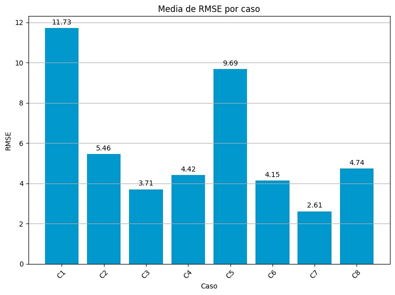
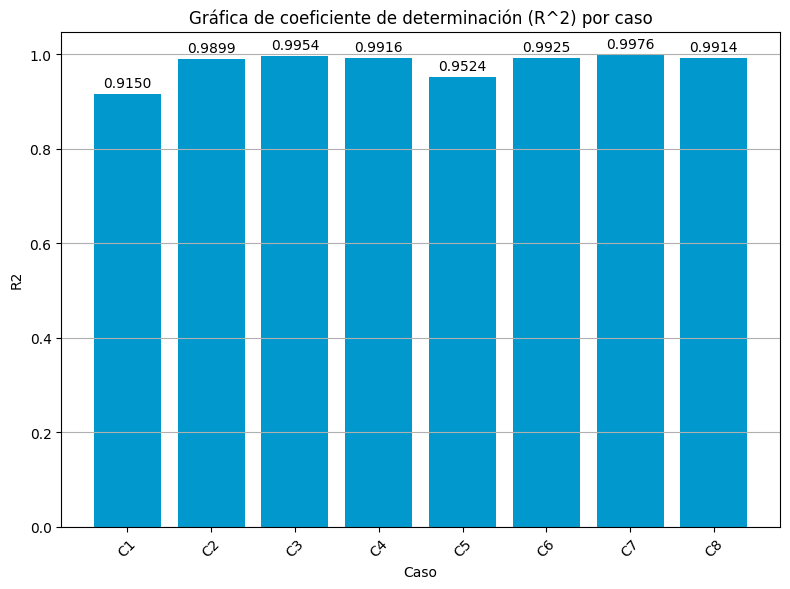
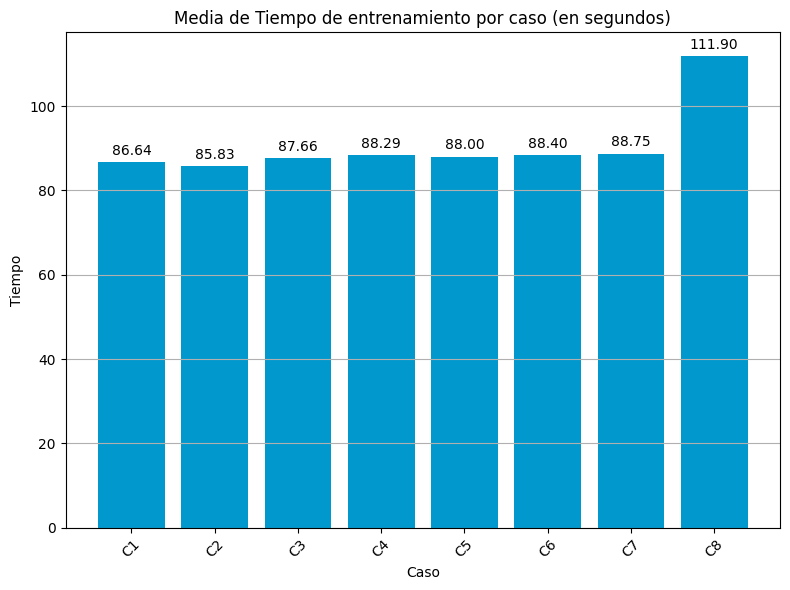
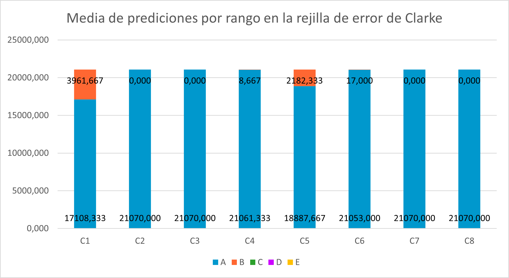

# Influencia de variables adicionales en la predicción de niveles de glucosa

[Xavi Coret Mayoral](https://xcoret.github.io/portfolio/)

Universidad Internacional de la Rioja [UNIR](https://unir.net)

## Resumen
La predicción precisa de los niveles de glucosa es crucial para la dosificación de insulina y la gestión del estilo de vida de los pacientes con diabetes. Este estudio explora el uso de Redes Neuronales Recurrentes con Memoria de Corto y Largo Plazo para predecir los niveles de glucosa en sangre en la Diabetes Tipo 1. Se comparan diferentes modelos con conjuntos variables distintos para analizar la influencia de estos en la precisión de la predicción. Los resultados muestran que, incorporando variables adicionales, las predicciones tienden a mejorar. Sin embargo, la inclusión de más variables aumenta la complejidad computacional. El estudio destaca la importancia de encontrar un equilibrio entre la inclusión de variables adicionales y la viabilidad práctica para aplicar modelos predictivos en escenarios reales exitosamente.

### I. INTRODUCCIÓN
La diabetes mellitus afecta a millones de personas en todo el mundo y requiere un monitoreo continuo de la glucosa para prevenir complicaciones [1]. La diabetes tipo 1 se caracteriza, además, por la necesidad de que los pacientes reciban administración de insulina, ya sea mediante inyecciones o mediante una bomba de insulina. La investigación médica y la Inteligencia Artificial, en particular el Aprendizaje Automático, trabajan en conjunto para lograr predicciones precisas y confiables del nivel de glucosa. Esto aporta mejoras significativas en la calidad de vida de los pacientes con diabetes, ya que les permite planificar mejor sus actividades diarias y tomar decisiones más informadas sobre su salud. 

Este estudio tiene como objetivo llevar a cabo un análisis del efecto que la inclusión de variables adicionales tiene en las predicciones de los niveles de glucosa. Para lograrlo, se procede a entrenar diversos modelos de redes neuronales recurrentes LSTM y se efectúan predicciones empleando diferentes conjuntos de variables en distintos escenarios. El propósito es determinar si la incorporación de estas variables resulta en un impacto positivo, negativo o neutral en la precisión y fiabilidad de las predicciones realizadas.

### II. ESTADO DEL ARTE
En la actualidad, se han llevado a cabo numerosas investigaciones para predecir los niveles de glucosa en sangre, utilizando gran variedad paradigmas de la Inteligencia Artificial y Aprendizaje Profundo [2], la mayoría de los estudios indicaron que las Redes Neuronales Profundas y la Máquina de Vectores de Soporte (SVM)[3,4,5] consiguen ofrecer resultados muy precisos. Estas últimas han sido utilizadas en problemas de regresión combinadas con modelos fisiológicos para predecir los niveles de glucosa en sangre a partir de características como la hora del día, la actividad del paciente y la ingesta de insulina para realizar predicciones en tiempo real [6] la simplicidad, precisión y desempeño en tiempo real de este enfoque ha permitido la aplicación de este en dispositivos móviles [7]. 

Con la aparición de las redes neuronales, enfoques como las Redes Neuronales Convolucionales (CNN), que permiten procesar datos con topología de cuadrícula como imágenes y series temporales [8,9] como por ejemplo GluNet [10] y las Redes Neuronales Recurrentes (RNN)[11,12] y específicamente las Redes Neuronales Recurrentes de memoria a corto y largo plazo (LSTM)[13,14], las cuales tienen la capacidad de aprender patrones en datos distribuidos en forma de series temporales, han demostrado obtener resultados competitivos en comparación con las SVM [15,16].

El progreso tecnológico actual está impulsando un rápido desarrollo en este campo, permitiendo la implementación efectiva de métodos previamente limitados por recursos computacionales. Estas técnicas están demostrando ser prometedoras en la gestión de la diabetes al mejorar la precisión de las predicciones y personalizar la atención médica. Un ejemplo de ello es el el Desafío de Predicción de Niveles de Glucosa en Sangre, BGLP [17,18] donde investigadores en inteligencia artificial colaboraron para mejorar la predicción de glucosa en sangre con enfoques de aprendizaje automático en una competencia conjunta donde se presentaron propuestas innovadoras.

Un ejemplo fue una arquitectura novedosa propuesta por los ganadores del desafío [19] que empleaba una red neuronal recurrente para predecir gradualmente en etapas, mejorando el rendimiento y alcanzando un error promedio de 18.2 mg/dL en la predicción de glucosa para 30 minutos. Otra estrategia innovadora [20] se centró en transferir conocimiento entre modelos entrenados en diferentes conjuntos de datos mediante transferencia de aprendizaje de modo que mostró que usar un modelo preentrenado en datos de monitores de glucosa para predecir en el conjunto de datos OhioT1DM ofreció resultados comparables, con errores cuadráticos medios de 19.21 y 31.77 mg/dl para horizontes de 30 y 60 minutos.
El tercer clasificado de la competición adoptó una arquitectura modificada de Red Generativa Adversarial (GAN), combinando una red neuronal recurrente generadora y una convolucional discriminatoria para predecir glucosa en sangre [21]. Este enfoque demostró su prometedor rendimiento en métricas clave y relevancia clínica, como la rejilla de error de Clarke [22], respaldando su eficacia en la predicción de glucosa. 

La actualidad de la investigación en la predicción de niveles de glucosa en sangre está caracterizada por una diversidad de enfoques metodológicos avanzados que se nutren del progreso tecnológico. Estas estrategias no solo elevan la precisión de las predicciones, sino que también abren nuevas perspectivas para la personalización de la atención médica y la gestión efectiva de la diabetes. La selección de características relevantes sigue teniendo un papel importante para lograr una alta precisión y confianza en los modelos de predicción. Algunas de las características más utilizadas incluyen los niveles de glucosa anteriores, la variabilidad de los niveles de glucosa, la hora del día, la actividad física y la ingesta de alimentos. La identificación de las características más influyentes sigue siendo objeto de investigación activa.

### III. OBJETIVOS Y METODOLOGÍA
El objetivo general de este trabajo es evaluar el impacto de utilizar variables adicionales relacionadas con las mediciones de glucosa, la fecha y la hora de medición, en la predicción de los niveles de glucosa en pacientes con diabetes tipo 1. Determinando si la inclusión de variables adicionales inferidas a partir de estas variables utilizadas inicialmente mejora, empeora o no afecta la exactitud y coherencia de las predicciones. 

Este objetivo se pretende conseguir mediante el conseguimiento de objetivos específicos como: Estudiar el contexto y estado del arte de las técnicas y modelos utilizados en este ámbito; realizar un análisis exploratorio de los datos; implementar los modelos de predicción utilizando tanto las variables originales como las adicionales inferidas y finalmente comparar los resultados obtenidos para evaluar el impacto del uso de variables adicionales.

La metodología definida a seguir durante el desarrollo de este trabajo consiste en una serie de pasos establecidos para cumplir con los objetivos específicos y así conseguir cumplir también con el objetivo general de este trabajo. A continuación, se describen los pasos de esta metodología:
1.	Investigar acerca del estado del arte. Se realizó una investigación exhaustiva sobre el estado del arte en la predicción de niveles de glucosa en pacientes diabéticos. Esto implicó analizar numerosos artículos científicos, tesis doctorales y libros de referencia para comprender las técnicas y modelos utilizados. Esta investigación orientó la elección de la arquitectura y enfoque del estudio.
2.	Análisis exploratorio de los datos. Se ha empleado Python, un lenguaje común en Inteligencia Artificial, junto con librerías como Pandas y Numpy para procesar los archivos y los datos. Esto ha facilitado el procesamiento y ha permitido obtener información estadística y contextual. El objetivo ha sido identificar valores faltantes, discontinuidades y comprender los rangos de cada variable. De esta manera, se ha formado una idea general de los datos disponibles, lo que ha ayudado a planear la estrategia para extraer y utilizar variables adicionales en el entrenamiento y la evaluación de los modelos en la comparación de soluciones.
3.	Extracción de variables adicionales. Se ha decidido qué variables se pueden extraer de los datos originales, y se ha argumentado su posible utilidad e impacto en las predicciones que realizan los modelos. Estas variables se han añadido al conjunto de datos utilizado.
4.	Creación de series temporales. Se han organizado los datos de manera que se formen conjuntos de datos dispuestos en series temporales. Estas series temporales han servido para abastecer posteriormente a los modelos de predicción implementados. Se ha determinado el número de elementos que formarán cada serie temporal, así como el lapso que estas abarcarán.
5.	Segmentación del conjunto de datos. El quinto paso ha consistido en la creación de los conjuntos necesarios para entrenar una red neuronal y evaluar su rendimiento. Estos han sido el conjunto de entrenamiento, utilizado para que el modelo haya aprendido patrones de los datos, el conjunto de validación, utilizado para haber evaluado el modelo y durante el entrenamiento para haber mejorado su rendimiento, y el conjunto de prueba utilizado para haber probado la eficacia real del modelo, ya que ha consistido en ejemplos nuevos para el modelo que nunca antes ha visto. Esta segmentación del conjunto de datos se ha realizado a partir de funcionalidades de la librería de Python Scikit-Learn.
6.	Implementación de los modelos de predicción. En esta fase se han definido e implementado las arquitecturas de modelos de redes neuronales que han formado cada modelo. Para ello se han utilizado los “frameworks” de Keras y Tensorflow, los cuales han ofrecido recursos para la creación, entrenamiento y evaluación de redes neuronales de una forma más amigable para los programadores.
7.	Definición de los casos de prueba. Para poder realizar la comparación de soluciones, se han definido distintos casos que han sido definidos por las variables que se han utilizado en cada uno.
8.	Entrenamiento y obtención de resultados. Se ha procedido al entrenamiento y evaluación de los modelos implementados para cada caso de prueba definido y se han registrado los resultados para su posterior análisis. El entrenamiento de los modelos de predicción se ha realizado con GPU mediante la tarjeta gráfica NVIDIA GeForce GTX 1650 [23].
El código implementado para el desarrollo de este trabajo puede ser consultado en el repositorio público dedicado [24].

> TABLA I. CASOS DE PRUEBA DEFINIDOS

|Caso|Variables|
|:-|:-|
|Caso1 (C1)|Measurement|
|Caso2 (C2)|Measurement, Month, Day|
|Caso3 (C3)|Measurement, Weekday|
|Caso4 (C4)|Measurement, Hour, Minute|
|Caso5 (C5)|Measurement, Daytime|
|Caso6 (C6)|Measurement, Trend, Diagnostic|
|Caso7 (C7)|Measurement, Difference|
|Caso8 (C8)|Measurement, Month, Day, Weekday, Daytime, Trend, Diagnostic, Difference|

La Tabla I muestra las variables utilizadas en cada caso de prueba.

### IV. CONTRIBUCIÓN
El presente trabajo tiene como propósito brindar información valiosa para la optimización de modelos de predicción en el ámbito médico. Esto se logra al analizar el impacto que puede surgir al emplear diversos conjuntos de variables adicionales durante el entrenamiento y la realización de predicciones en estos modelos. De esta manera, se contribuye a obtener una comprensión más precisa sobre los beneficios o perjuicios derivados de la incorporación de variables adicionales. Estos beneficios abarcan desde la mejora de la precisión hasta la optimización del modelo y la comprensión del fenómeno estudiado. Todo ello respalda la toma de decisiones fundamentadas y la construcción de modelos más efectivos y confiables.

### V. EVALUACIÓN Y RESULTADOS 
Se han empleado dos enfoques para evaluar los resultados de los experimentos basados en los datos disponibles.
#### Evaluación de cada modelo
El primer enfoque ha implicado analizar el promedio de los resultados de cada modelo, lo que ha permitido obtener una comprensión más clara acerca de qué modelo ha exhibido un rendimiento superior. Esta información ha resultado útil para determinar si la utilización de diferentes conjuntos de variables puede haber tenido un impacto positivo o negativo dependiendo del modelo.

> TABLA II. MEDIA DE LAS MÉTRICAS PARA CADA MODELO

|Métrica|Modelo1|Modelo2|Modelo3|
|:-|:-|:-|:-|
|RMSE|0,41476433|12,6296951|4,39244588|
|R2|0,99993964|0,93973385|0,99498558|
|Tiempo entrenamiento (seg.)|54,2037613|114,941446|102,911749|

La Tabla II muestra como el modelo M1 consigue los mejores resultados, en las tres métricas analizadas, seguido del modelo M3 y finalmente el modelo M2.

#### Evaluación de cada caso
El segundo enfoque se enfoca en examinar el promedio de los resultados de cada caso para cada modelo, lo que proporciona una visión más profunda sobre cómo la utilización de conjuntos específicos de variables influye en el rendimiento general de los diversos modelos.

> TABLA III. MEDIA DE LAS MÉTRICAS PARA CADA CASO

|Caso|RMSE|R^2|Tiempo entrenamiento (seg.)|
|:-|:-|:-|:-|
|C1|11,728|0,915|86,641|
|C2|5,459|0,990|85,835|
|C3|3,707|0,995|87,661|
|C4|4,416|0,992|88,295|
|C5|9,688|0,952|88,004|
|C6|4,151|0,993|88,397|
|C7|2,611|0,998|88,750|
|C8|4,738|0,991|111,902|

La Tabla III muestra como en el caso C7 se consigue el RMSE medio entre los tres modelos menor y también el mayor coeficiente de determinación.
También se denota como el caso C8 que utiliza todas las variables resulta un incremento del tiempo de entrenamiento significativo.

### VI. DISCUSIÓN
Los resultados obtenidos han sido analizados a partir de los dos enfoques definidos previamente. De este modo se obtiene una visión del impacto del uso de variables adicionales en cada modelo y también en cada caso. En este análisis se ha tenido en cuenta las métricas de RMSE, R2, el tiempo de entrenamiento y los resultados obtenidos al aplicar la rejilla de error de Clarke a las predicciones realizadas.

#### Evaluación de cada modelo
El modelo más simple (M1) en el caso C1 (usando únicamente la variable del nivel de glucosa) logra los mejores resultados, demostrando su eficacia con un RMSE de 0.035, un valor de R2 de 0.9999997 y un tiempo de entrenamiento de aproximadamente 47 segundos.
Sin embargo, esta aparente superioridad de un enfoque más simple se contradice cuando se observa el rendimiento del modelo M2 en el mismo caso, que presenta un rendimiento inferior en términos de RMSE y R2, lo que resalta la importancia del modelo de aprendizaje profundo utilizado. Además, se nota que el rendimiento más destacado del modelo M1 se repite en el caso C6, donde se han incorporado variables adicionales, como “Trend” y “Diagnostic”, relacionadas con el estado general de la glucosa en sangre y su evolución. En este caso, el modelo M1 logra un RMSE de 0,12424 y un R2 de 0,99999629 , con un tiempo de entrenamiento apenas 2 segundos mayor que en el mejor caso.  

La tendencia general en el análisis de rendimiento revela que el modelo M1 muestra la mayor exactitud y eficiencia en el tiempo de entrenamiento en la mayoría de los casos, seguido por M3, mientras que M2 presenta resultados menos satisfactorios. Además, es importante destacar que la inclusión de más variables no necesariamente mejora la precisión de los modelos. En algunos casos, como en el caso C3, resulta más efectivo utilizar un número limitado de variables, como “Measurement” y “Weekday”, en lugar de utilizar todas las variables disponibles, como se hizo en el caso C8. Esto resalta la importancia de seleccionar cuidadosamente las variables más relevantes para mejorar la capacidad predictiva.

En términos de métricas de exactitud y variabilidad, se observa que los modelos M1 y M3 obtienen bajos valores de RMSE y altos valores de R2, denotando su capacidad para ajustarse y explicar la variabilidad de los datos. El modelo M2, aunque explica mucha variabilidad, presenta un RMSE más alto y un R2 ligeramente inferior. En cuanto a la eficiencia temporal, M1 destaca por su rapidez en los entrenamientos debido en gran parte a la simplicidad de su arquitectura, mientras que M2 y M3 requieren más tiempo, especialmente en casos con más variables.

#### Evaluación de cada caso
El caso C7 muestra un menor RMSE promedio, lo que sugiere que las variables "Measurement" y "Difference" contribuyen a predicciones más precisas en comparación con otras combinaciones. Sin embargo, es importante destacar que en todos los casos, excepto el primero que no utilizó variables adicionales, el RMSE promedio se mantuvo por debajo de 10 mg/dl.

> Fig. 1.  Comparación de la media de RMSE por caso.

Además, se observa que el uso de un mayor número de variables no siempre mejora la precisión de los modelos. Por ejemplo, el caso 7 obtuvo mejores resultados con solo dos variables, mientras que el caso 8 tuvo un rendimiento inferior al utilizar las 8 variables disponibles. 

En todos los casos, los modelos han logrado una explicación casi perfecta de la variabilidad de los datos, con una media del coeficiente de determinación (R2) superior a 0,99. Notablemente, incluso en el caso 1 donde no se emplearon variables adicionales, los casos restantes mostraron un R2 más alto. Esto sugiere que la inclusión de variables adicionales posiblemente mejoró la precisión de los modelos entrenados.

> Fig. 2.  Comparación de la media del coeficiente de determinación por caso.

El modelo M1 completó todos sus entrenamientos en menos de un minuto, excepto en el caso 8, donde el tiempo de entrenamiento se extendió a un minuto y medio. Este último caso utilizó más de tres variables, lo que sugiere que un aumento en el número de variables puede ralentizar el proceso de entrenamiento de los modelos debido a la necesidad de procesar una mayor cantidad de datos. Este fenómeno está relacionado con el problema de la maldición de la dimensionalidad mencionado anteriormente.

Es importante destacar que el incremento en el tiempo de entrenamiento puede ser impracticable, especialmente si se utilizan herramientas menos potentes. Aunque en este estudio se empleó una GPU para el entrenamiento de los modelos, el uso de una CPU podría prolongar significativamente el tiempo de entrenamiento.

> Fig. 3.  Comparación de la media de la duración del entrenamiento por caso.

Finalmente, el análisis de la rejilla de error de Clarke respalda la confianza en la capacidad de los modelos para realizar predicciones de niveles de glucosa seguros que no conllevan a diagnósticos erróneos, ya que, como se puede ver en la figura 4 la mayoría de las predicciones caen en las regiones A y B de la rejilla, indicando un buen ajuste y exactitud en las predicciones. Estos hallazgos subrayan la importancia de la elección adecuada de variables y modelos en la construcción de modelos de predicción para problemas de este tipo.

> Fig. 4.  Media de predicciones por región en la rejilla de error de Clarke

### VII. CONCLUSIONES
La revisión de las métricas obtenidas en este estudio resalta varias conclusiones clave. En primer lugar, se evidencia un efecto positivo derivado de la incorporación de variables adicionales en la predicción y definición de los modelos, ya que esto se traduce en mejoras notables en las métricas de rendimiento. Este impacto positivo se manifiesta claramente en las medias de los resultados de los tres modelos en cada caso analizado.

Es fundamental tener en cuenta que el uso de un número creciente de variables no viene sin sus desafíos. Uno de los principales inconvenientes observados es el aumento en los tiempos de entrenamiento de los modelos. A medida que se agregan más variables, la complejidad computacional aumenta, lo que puede traducirse en una prolongación del tiempo necesario para el ajuste de los algoritmos. Esto es especialmente relevante en situaciones donde se dispone de recursos computacionales limitados o cuando se trabaja con conjuntos de datos masivos.

Sin embargo, esta aparente superioridad de un enfoque más simple se contradice cuando se observa el rendimiento del modelo M2 en el mismo caso, que presenta un rendimiento inferior en términos de RMSE y R2, lo que resalta la importancia del modelo de aprendizaje profundo utilizado. Además, se nota que el rendimiento más destacado del modelo M1 se repite en el caso C6, donde se han incorporado variables adicionales, como “Trend” y “Diagnostic”, relacionadas con el estado general de la glucosa en sangre y su evolución.

Es importante encontrar un equilibrio entre la inclusión de variables adicionales y la eficiencia del proceso de entrenamiento. Dependiendo del contexto y de las herramientas informáticas disponibles, puede ser necesario tomar decisiones sobre qué variables incorporar y en qué cantidad, con el objetivo de obtener modelos lo suficientemente precisos sin sacrificar la viabilidad de su implementación práctica.

La tendencia general en el análisis de rendimiento revela que el modelo M1 muestra la mayor exactitud y eficiencia en el tiempo de entrenamiento en la mayoría de los casos, seguido por M3, mientras que M2 presenta resultados menos satisfactorios. Además, es importante destacar que la inclusión de más variables no necesariamente mejora la precisión de los modelos. En algunos casos, como en el caso C3, resulta más efectivo utilizar un número limitado de variables, como “Measurement” y “Weekday”, en lugar de utilizar todas las variables disponibles, como se hizo en el caso C8.

En conclusión, el estudio ha demostrado que el uso de variables adicionales es una estrategia prometedora para mejorar la calidad de los modelos de predicción en el campo estudiado. No obstante, es fundamental considerar los aspectos prácticos y computacionales para garantizar que la inclusión de más variables se traduzca en beneficios reales y no en problemas operativos. Una planificación adecuada y una comprensión profunda de las implicaciones asociadas son clave para obtener resultados exitosos en la aplicación de estos modelos en situaciones reales.

En términos de métricas de exactitud y variabilidad, se observa que los modelos M1 y M3 obtienen bajos valores de RMSE y altos valores de R2, denotando su capacidad para ajustarse y explicar la variabilidad de los datos. El modelo M2, aunque explica mucha variabilidad, presenta un RMSE más alto y un R2 ligeramente inferior. En cuanto a la eficiencia temporal, M1 destaca por su rapidez en los entrenamientos debido en gran parte a la simplicidad de su arquitectura, mientras que M2 y M3 requieren más tiempo, especialmente en casos con más variables.

Finalmente, el análisis de la rejilla de error de Clarke respalda la confianza en la capacidad de los modelos para realizar predicciones de niveles de glucosa seguros que no conllevan a diagnósticos erróneos, ya que la mayoría de las predicciones caen en las regiones A y B de la rejilla, indicando un buen ajuste y exactitud en las predicciones. Estos hallazgos subrayan la importancia de la elección adecuada de variables y modelos en la construcción de modelos de predicción para problemas de este tipo.

### VIII. LÍNEAS DE TRABAJO FUTURO
Debido al tiempo limitado para llevar a cabo este estudio, algunas líneas de investigación no se pudieron explorar completamente, lo que abre oportunidades para futuras investigaciones.

Una de las líneas de investigación prometedoras para el futuro es realizar un análisis exhaustivo de las combinaciones de variables que podrían tener un mayor impacto en la precisión y eficacia de los modelos de predicción de los niveles de glucosa en sangre. Este análisis permitiría determinar qué variables son realmente relevantes y cuáles podrían ser innecesarias para la tarea de predicción.

Otra línea interesante para futuras investigaciones sería proponer un caso de uso para completar un conjunto de datos con valores faltantes entre registros, utilizando las predicciones obtenidas. En el presente trabajo, se excluyeron los registros cuya distancia temporal era mayor a 15 minutos respecto al siguiente registro. Sin embargo, se podría explorar la posibilidad de predecir el valor de glucosa en sangre para reducir el número de valores faltantes en el conjunto de datos.

Ambas líneas de trabajo futuro tienen el potencial de mejorar la comprensión y la precisión de los modelos de predicción de glucosa en sangre, lo que contribuiría significativamente a la investigación en esta área y a la aplicación de estos modelos en situaciones prácticas 
